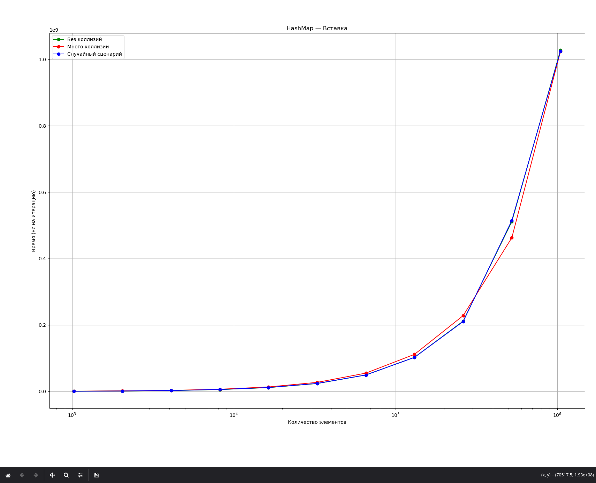
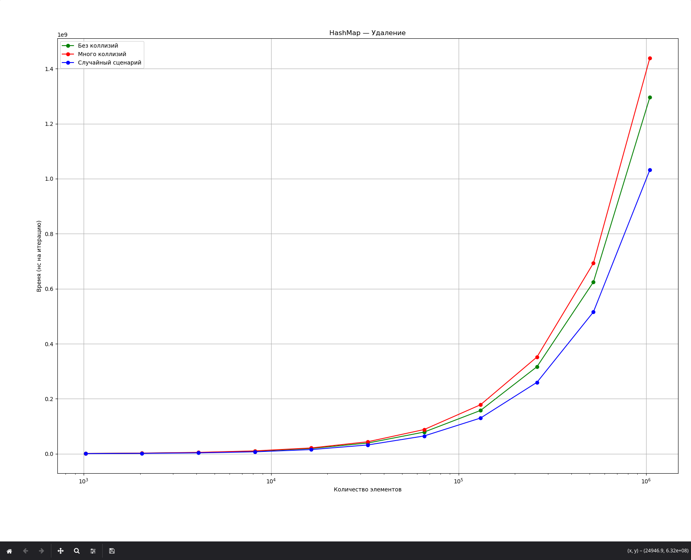
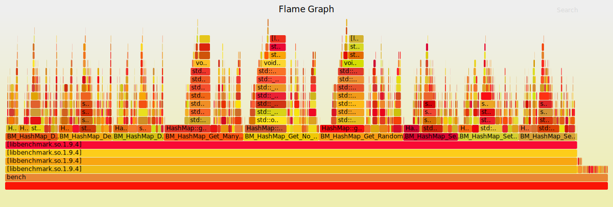

# 1 ЛР. HashMap, бенчмарки, сэмплирование, flamegraph, оптимизация

## Задание

```
Необходимо написать свою реализацию словаря (в качестве типов можно использовать число для ключа и строку для значения) с операциями вставки, добавления и удаления согласно варианту:
0 - Самобалансирующееся дерево поиска.
1 - Хэш-таблица с цепочками.
2 - Хэш-таблица с открытой адресацией.

Детали реализации (например, организация элементов дерева в памяти, или алгоритм хэширования ключа) остаются на ваше усмотрение.

Для словаря нужно написать бенчмарки, измеряющие скорость вставки, добавления и удаления элементов. Нужно рассмотреть различные сценарии, при которых производительность реализованной структуры будет зависеть от входных данных - вставка данных с большим количеством коллизий для хэш-таблицы, вставка отсортированных данных в B-дерево, и т. д.

Результатом бенчмарков должен быть набор графиков распределения задержки для оптимальных, наихудших, и случайных входных данных. Обратите внимание, что распределения должны быть логически объяснимыми и воспроизводимыми. Может быть полезно сравнить ваше распределение задержек с аналогичным от используемых в стандартной библиотеке структур данных.

Затем, используя инструменты для сэмплирования или трассировки, необходимо определить, что является "бутылочным горлышком" при работе с реализованным словарем. Ответ должен быть подкреплен flamegraph-ами, статистикой сэмплирования либо любым другим способом визуализации задержек.

Дополнительное задание: используя полученную информацию, ускорить свою структуру данных, и подтвердить ускорение еще одной итерацией бенчмарков. В зависимости от качества изначальной имплементации, ускорение может быть как в разы, так и на единицы-десятки процентов.
```

Мой вариант - 509092 % 3 = 1 (Хэш таблица с цепочками)

## Алгоритм работы

1. сделать хэш мапу
2. Написать бенчмарк для измерения скорости
    - вставки
    - добавления
    - удаления элементов
    - рассмотреть разные сценарии:
        * много коллизий
        * мало коллизий
        * и пр
Результатом должен быть набор графиков распределения задержки для оптимальных, наихудщих и случайных входных данных, распределение должно быть логически объяснимым и воспроизводимым.
3. Использовать инструменты для сэмплирования и трассировки определить бутылочное горлышко реализованного словаря.
В качестве пруфов flamegraph'ы, статистика сэмплирования или что-то ещё
4. Проанализировать результаты и исходя из них понять что нужно поправить в программе чтобы её ускорить

## Ход работы:

### 1. Хэшмапа

Была реализована хэшмапа с цепочками (Файлы ./hashmap.cpp и ./hashmap.h)

### 2. Бенчмарки

При помощи библиотеки https://github.com/google/benchmark был реализован файл с бенчмарками (см benchmark.cpp)

Для всех бенчмарков использована хэш таблица на 2^20 элементов

Было реализовано три группы бенчмарков:
1. Вставка
2. Поиск
3. Удаление

Для каждой группы реализовано по 3 бенчмарка
1. Без коллизий
2. Много коллизий
3. Случайные коллизии

Для случая без коллизий использована хэш функция предоставляющая каждому ключу свой бакет:

```cpp
int CACHE_NO_COLLISIONS(TKey key, int capacity) {
    return key % capacity;
}
```

Для случая с множеством коллизий размер хэша уменьшен в 100 раз

```cpp
int CACHE_MANY_COLLISIONS(TKey key, int capacity) {
    return (key / 100) % capacity;
}
```

Для случая со случайным естественным распределением был использован мультипликативный хэш для равномерного распределения

```cpp
int CACHE_RANDOM_COLLISIONS(TKey key, int capacity) {
    return (key * 2654435761) % (1 << 30) % capacity;
}
```

По оси X представлено количество элементов в хэшмапе (в логарифмической шкале)

Результаты бенчмарков представлены ниже






Видно что для всех операций количество коллизий сильно влияет на время итерации

Графики сгенерированы на основе полученного report.json файла выданного библиотекой bench

```bash
./bench --benchmark_out=report.json --benchmark_out_format=json
```

Графики сгенерированы через matplotlib с помощью python скрипта generate-graph.py

### 3. Сэмплирование

Сэмплирование было произведено через утилиту perf

```bash
perf record -F 99 -g --call-graph=dwarf ./bench
```

результат был сохранён в perf.data

Далее через утилиту https://github.com/brendangregg/FlameGraph результат был преобразован в знакомый утилите формат 

```bash
perf script | stackcollapse-perf.pl > out.folded
```

потом из этого файла был получен интерактивный svg файл с flamegraph'ом 

```bash
flamegraph.pl out.folded > flamegraph.svg
```

Флеймграф представлен ниже



