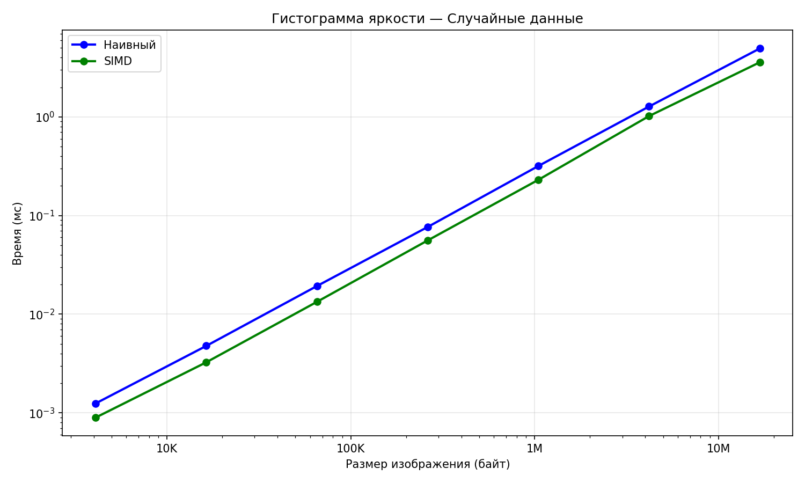
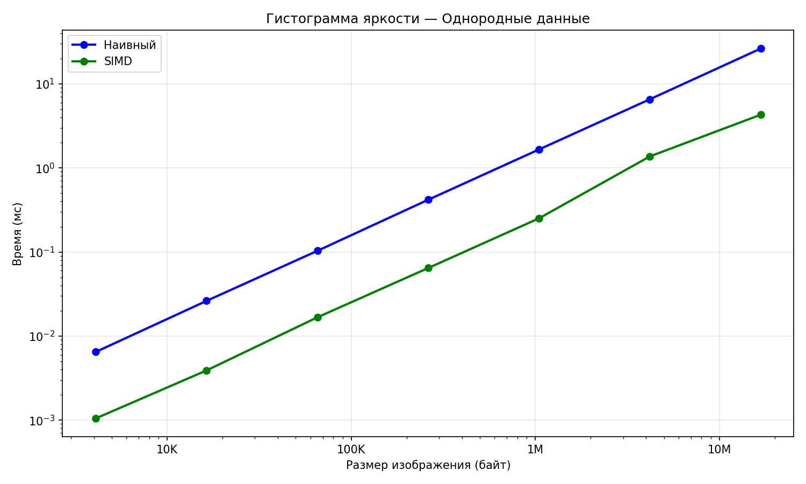
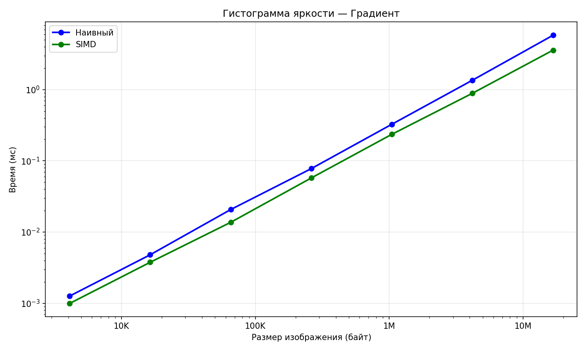
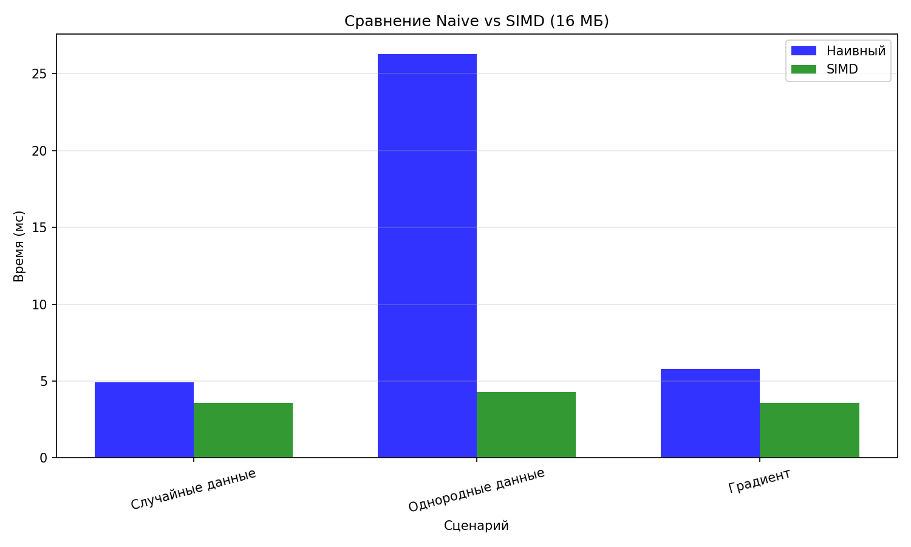

# 2 ЛР. Гистограмма яркости, SIMD-оптимизация

## Задание

```
По вариантам (каждому студенту выдается 1-3 задания в зависимости от сложности) необходимо 
написать наивное (последовательное) решение на C++, и векторизованное решение, использующее 
SIMD-инструкции:

6. построить гистограмму яркости 8-битного монохромного изображения;

Необходимо сравнить производительность наивного и векторизованного решения. Для этого 
требуется выбрать метрику в зависимости от задачи (например, количество обрабатываемых 
байт в секунду). Входные данные нужно сгенерировать либо подобрать в любом доступном источнике.
```

Мой вариант - 6 (построить гистограмму яркости 8-битного монохромного изображения)

## Описание задачи

Гистограмма яркости — это массив из 256 элементов, где каждый элемент содержит количество 
пикселей с соответствующим значением яркости (от 0 до 255) в изображении.

## Реализация

### Наивный алгоритм

Простой последовательный проход по всем пикселям изображения:

```cpp
void histogram_naive(const uint8_t* data, size_t size, Histogram& hist) {
    std::memset(hist.data(), 0, sizeof(Histogram));
    for (size_t i = 0; i < size; ++i) {
        ++hist[data[i]];
    }
}
```

### SIMD-оптимизированный алгоритм

Для SIMD-версии используется техника с несколькими локальными гистограммами для уменьшения 
конфликтов при обновлении счётчиков. Реализованы версии для:

- **ARM NEON** (Apple Silicon, ARM64): загрузка 16 байт за раз с помощью `vld1q_u8`
- **AVX2** (x86-64): загрузка 32 байт за раз с помощью `_mm256_loadu_si256`

Основная идея оптимизации:
1. Создаются 4 независимые локальные гистограммы
2. Пиксели распределяются между гистограммами для минимизации cache line конфликтов
3. В конце все локальные гистограммы суммируются с помощью SIMD-инструкций

## Структура проекта

- `histogram.h` — заголовочный файл с объявлениями функций
- `histogram.cpp` — реализация наивного и SIMD-алгоритмов
- `benchmark.cpp` — бенчмарки с использованием Google Benchmark
- `CMakeLists.txt` — файл сборки

## Сборка и запуск

```bash
# Сборка
cmake -B build -DCMAKE_BUILD_TYPE=Release
cmake --build build

# Запуск бенчмарков
./build/bench

# Запуск с сохранением результатов
./build/bench --benchmark_out=report.json --benchmark_out_format=json
```

## Тестовые сценарии

Реализовано три сценария тестирования:

1. **Random** — случайное распределение пикселей (равномерное от 0 до 255)
2. **Uniform** — все пиксели имеют одинаковое значение (худший случай для cache)
3. **Gradient** — линейный градиент (последовательные значения 0, 1, 2, ..., 255, 0, 1, ...)

## Метрика производительности

Используется метрика **байт в секунду** (bytes/sec), которая показывает скорость обработки 
данных изображения. Это позволяет сравнивать производительность на изображениях разного размера.

## Результаты бенчмарков

Тестирование проводилось на Apple Silicon (ARM64) с использованием NEON инструкций.

### Сводная таблица (изображение 16 МБ)

| Сценарий | Naive | SIMD | Ускорение |
|----------|-------|------|-----------|
| Random   | 3.18 GB/s | 4.47 GB/s | **1.4x** |
| Uniform  | 0.62 GB/s | 3.79 GB/s | **6.1x** |
| Gradient | 2.91 GB/s | 4.42 GB/s | **1.5x** |

### Анализ результатов

1. **Random (случайные данные)**: SIMD-версия показывает ускорение ~1.4x благодаря 
   параллельной загрузке данных и использованию нескольких локальных гистограмм.

2. **Uniform (однородные данные)**: Наибольшее ускорение ~6x! Наивная версия страдает от 
   конфликтов cache line, так как все инкременты идут в одну ячейку. SIMD-версия 
   распределяет нагрузку между 4 локальными гистограммами.

3. **Gradient (градиент)**: Ускорение ~1.5x, похоже на случайные данные, так как 
   обращения к памяти распределены равномерно.

### Полные результаты бенчмарков

```
BM_Histogram_Naive_Random/16777216      ~5.0 ms    3.18 GB/s
BM_Histogram_SIMD_Random/16777216       ~3.5 ms    4.47 GB/s

BM_Histogram_Naive_Uniform/16777216    ~26.0 ms    0.62 GB/s
BM_Histogram_SIMD_Uniform/16777216      ~4.1 ms    3.79 GB/s

BM_Histogram_Naive_Gradient/16777216    ~5.4 ms    2.91 GB/s
BM_Histogram_SIMD_Gradient/16777216     ~3.5 ms    4.42 GB/s
```

### Графики









## Выводы

SIMD-оптимизация даёт ускорение за счёт:
- Параллельной загрузки нескольких пикселей (16 байт за раз с NEON)
- Уменьшения зависимостей между операциями благодаря нескольким локальным гистограммам
- Векторного суммирования локальных гистограмм в конце

Особенности:
- На однородных данных ускорение максимально (6x) из-за устранения cache line конфликтов
- На случайных и градиентных данных ускорение ~1.4-1.5x
- Производительность стабильна при разных размерах изображения
